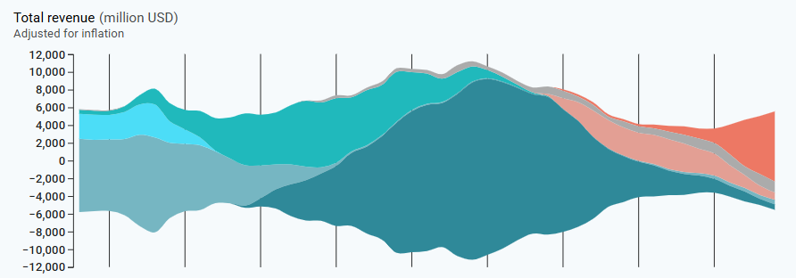
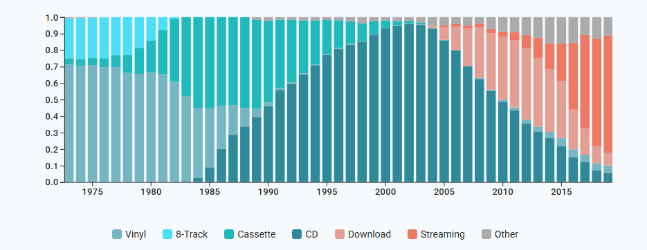

# Lab 5: Pie and Stack Layouts

---

## Checkpoint 1: Donuts

## Checkpoint 2: Stream Graph

## Checkpoint 3: Stacked Bar Chart

## Checkpoint 4: Apply to a New Dataset

In this checkpoint, you will apply the ideas from the previous sections to a new dataset of annual film revenue by genre. Unlike the earlier checkpoints, this dataset has a more realistic structure and will require you to reason carefully about how to extract, transform, and encode the data.

> This dataset contains genre statistics for movies released between 1995 and 2018. It provides information on various aspects of the movies, such as gross revenue, tickets sold, and inflation-adjusted figures. The dataset includes columns for genre, year of release, number of movies released in each genre and year, total gross revenue generated by movies in each genre and year, total number of tickets sold for movies in each genre and year, inflation-adjusted gross revenue that takes into account changes in the value of money over time, title of the highest-grossing movie in each genre and year, gross revenue generated by the highest-grossing movie in each genre and year, and inflation-adjusted gross revenue of the highest-grossing movie in each genre and year. This dataset offers insights into film industry trends over a span of more than two decades

[films.csv](data/films.csv)